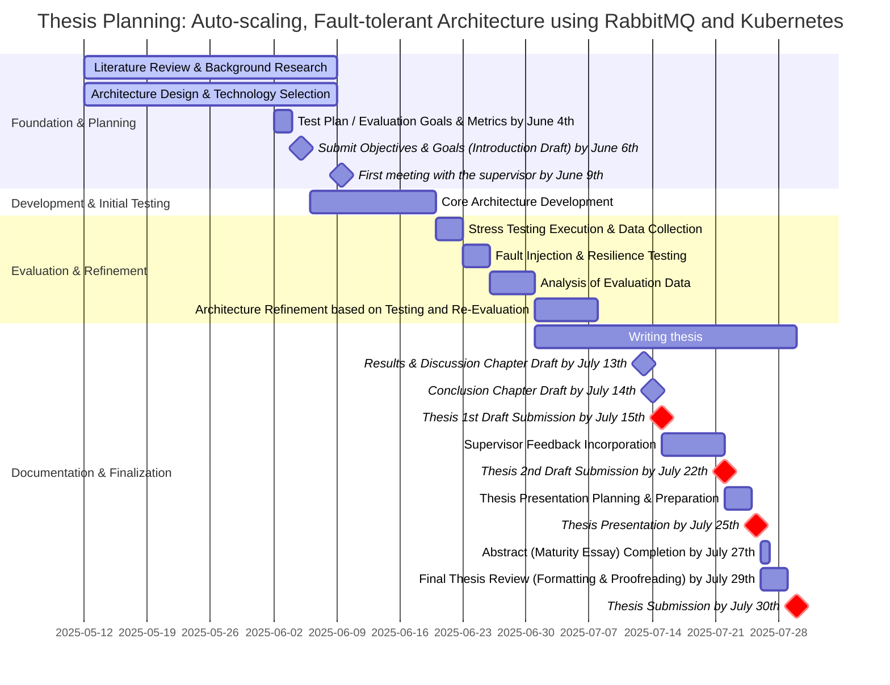

```mermaid
gantt
    dateFormat  YYYY-MM-DD
	tickInterval 1week
	weekday monday

    title Thesis Planning: Auto-scaling, Fault-tolerant Architecture using RabbitMQ and Kubernetes

    section Foundation & Planning
    Literature Review & Background Research :active, lit_review, 2025-05-12, 4w
    Architecture Design & Technology Selection :active, arch_design, 2025-05-12, 4w
	Test Plan / Evaluation Goals & Metrics by June 4th :test_plan, 2025-06-02, 2025-06-04 
    Submit Objectives & Goals (Introduction Draft) by June 6th : milestone, goal, after test_plan, 2025-06-06
	First meeting with the supervisor by June 9th: milestone, first_meeting, 2025-06-09, 1d
    
	section Development & Initial Testing
    Core Architecture Development :core_dev, after goal, 2025-06-20

    section Evaluation & Refinement
    Stress Testing Execution & Data Collection :stress_test, after core_dev, 2025-06-23
    Fault Injection & Resilience Testing :fault_test, after stress_test, 2025-06-26
    Analysis of Evaluation Data :data_analysis, after fault_test, 2025-07-01
    Architecture Refinement based on Testing and Re-Evaluation : arch_refine, after data_analysis, 2025-07-08

    section Documentation & Finalization
	Writing thesis: thesis_write, 2025-07-01, 2025-07-30
    Results & Discussion Chapter Draft by July 13th : milestone, results_chap, 2025-07-13, 0d
    Conclusion Chapter Draft by July 14th : milestone, conclusion_chap, 2025-07-14, 0d
    Thesis 1st Draft Submission by July 15th : crit, milestone, draft_submission, 2025-07-15, 0d
    Supervisor Feedback Incorporation : feedback_incorporation, after draft_submission, 2025-07-22
	Thesis 2nd Draft Submission by July 22th : crit, milestone, 2025-07-22, 0d
    Thesis Presentation Planning & Preparation : presentation_plan, after feedback_incorporation, 2025-07-25
    Thesis Presentation by July 25th : crit, milestone, presentation, 2025-07-25, 1d
    Abstract (Maturity Essay) Completion by July 27th: abstract_completion, after presentation, 2025-07-27
    Final Thesis Review (Formatting & Proofreading) by July 29th: proofreading, after presentation, 2025-07-29
    Thesis Submission by July 30th: crit, milestone, thesis_submission, 2025-07-30, 0d
```