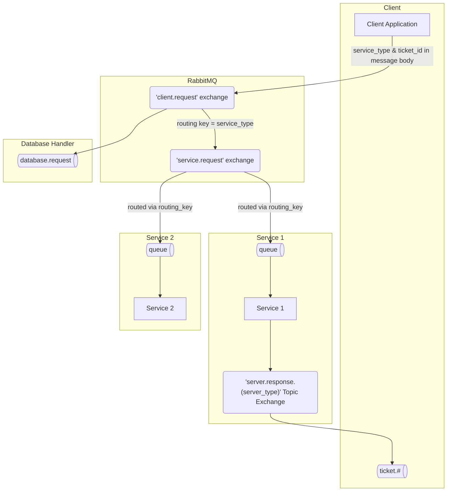

```mermaid
graph TB

	subgraph Client
		A[Client Application] 
		J@{shape: das, label: "ticket.#"}
	end

	subgraph RabbitMQ
		B@{ shape: rounded, label: "'client.request' exchange"}
		C@{ shape: rounded, label: "'service.request' exchange"}

		B -->|routing key = service_type| C
		
	end

	A --> |service_type & ticket_id in message body| B
	
	subgraph Service 1

		direction LR

		E[Service 1]

		F@{shape: das, label: "queue"}
		C --->|routed via routing_key| F
		F ---> E

		I@{ shape: rounded, label: "'server.response.(server_type)' Topic Exchange"}
		E ---> I
		I ---> J
	end


	subgraph Service 2
		direction LR

		G[Service 2]

		H@{shape: das, label: "queue"}
		C --->|routed via routing_key| H
		H ---> G

	end


	subgraph Database Handler
		D@{ shape: das, label: "database.request"}
		B --> D
	end
```