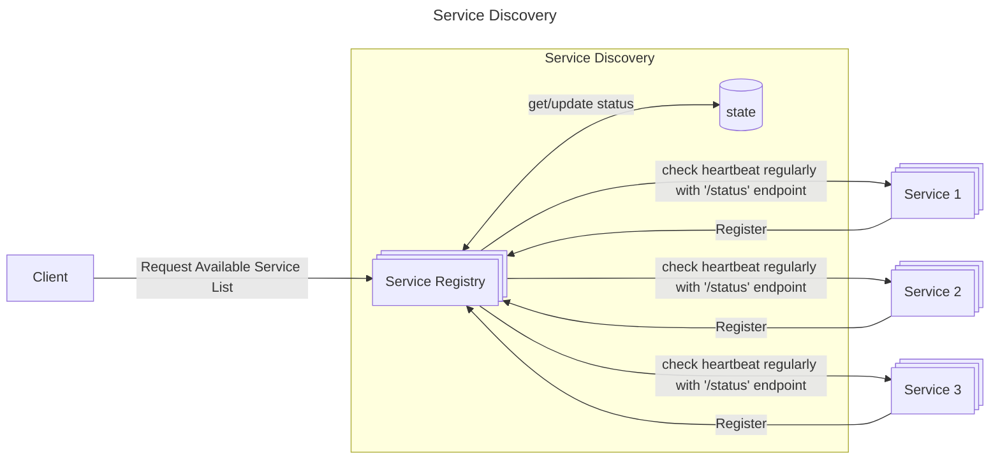

```mermaid
---
title: Service Discovery
---

graph LR


	subgraph Service Discovery
		direction TB
		A@{ shape: procs, label: "Service Registry" }
		F@{ shape: database, label: "state"}	

	end

	B@{ shape: procs, label: "Service 1" }
	C@{ shape: procs, label: "Service 2" }
	D@{ shape: procs, label: "Service 3" }


	B --->|Register| A
	C --->|Register| A
	D --->|Register| A

	E@{ shape: proc, label: "Client" }

	E --->|Request Available Service List| A

	A --->|check heartbeat regularly with '/status' endpoint| B
	A --->|check heartbeat regularly with '/status' endpoint| C
	A --->|check heartbeat regularly with '/status' endpoint| D

	A <-->|get/update status| F
```